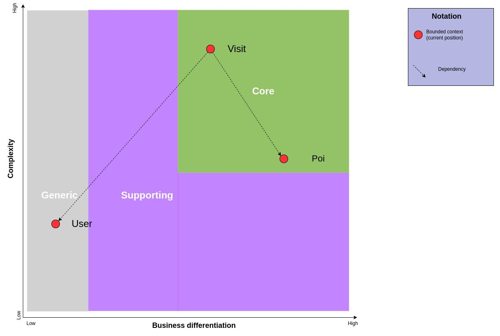
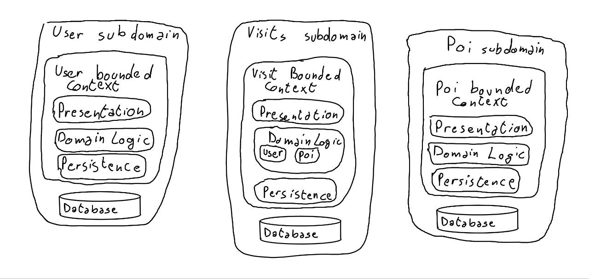
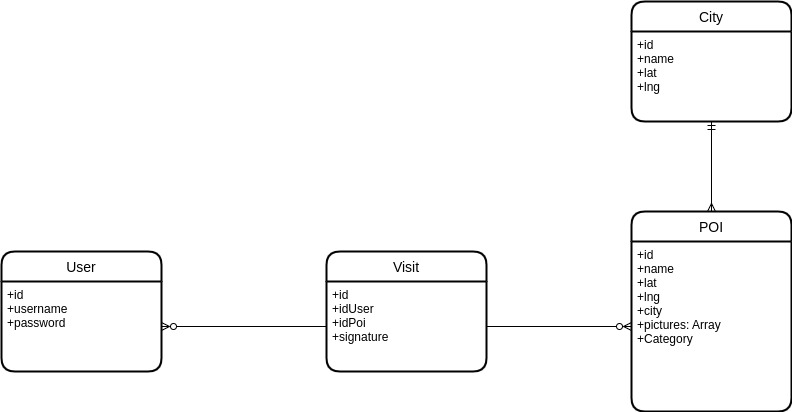

# Smart Tourist

# Table of contents
1. [Introduction](#introduction)
2. [Domain Driver Design](#ddd)
3. [Design](#design)
4. [Development](#development)
6. [Sharing](#sharing)
5. [Continuous integration/delivery/deployment](#cicd)
8. [Conclusion](#conclusion)

# Introduction <a name="introduction"></a>
Smart tourist is an application for tourists, it aims to make the experience of visiting a new city more easy and less stressful. This app is meant to give users the possibility to fully and truly understand the history of a city, making the process as fun and interactive as possible.
To do so it relies on an Android application and an online server (composed by different microservices).
The Android app shows to the users a map with different points of interest next to them, the user can then go to every one of this points of interest and read a QR code positioned in that place, after the scannerization of the qr code the app will show info, pictures and a space where the user can sign himself and leave a message for other users and optionally read one other messages.


# Domain Driven Design <a name="ddd"></a>

Domain-driven design is a software design and development approach presented by Eric Evans in his book of the same name. DDD is focused on modeling software so as to match a domain according to input created by the domain created by domain experts together with developers.

This is a simple description of what is being thought of when thinking about ddd, but what ddd really is?
Domain-driven design is a methodology, because it defines software development support practices, entering the wider field of agile methodologies.
Domain-driven design is a set of patterns, because it defines a set of patterns for building domain models.
Domain-driven design is a complexity management technique: it avoids unnecessary complexity and offers tools for scalable management of the complexity of our application.
## Knowledge crunching
The team is composed of two people, Luca Rossi and Davide Schiaroli who are in fact the product owners too.
We talked with each other to design the app, trying to understand what each other wanted to create with this project and even coming up with some terms that ended up being very important and important for the project but for us this process was not enough to be called *knowledge crunching*. 
To mitigate this issue we instructed two colleagues with some information about our project and we simulated an interview, during which we were supposed to be the team with no knowledge about the project, trying to understand how they envisioned the app, finding key points, differences and so on.
It worked! The idea of the app was practically the same (of course) but they added new concepts and interesting ideas that were coherent with the project and that could have helped it, like badges for the users, zones of interest and other cool ideas that we did not implement because they were too time taking. In a real life project we could have translated this scenario with a demanding client who happened to have a low budget. In cases like this the only option is to negotiate and we managed to maintain the same level of quality at the cost of some functionalities.  

##  User stories

User stories are a highly abstract way to represent how a team should develop a product.
User stories follow a common pattern:

As [user description], 
i want to [functionality or action] 
so that [goal].

In this way a lot of details can be explained, making programmer's work simple. 
Although it is not a practice based solely on the ddd, user stories are used frequently, because they are extremely simple but effective.

For our purposes, we had to simulate two actors, the tourist and a normal citizen.
### Tourist 
As a tourist, I want to fully experience the new places that I visit.

As a tourist, I want to find places of interest next to me.

As a tourist, I want to know the history of a place.

As a tourist, I want to know the local history of the city I’m visiting.

As a tourist, I want to visit as many places as I can.

As a tourist, I want to remember what I visited.

### Citizen
As a citizen, I want to increase the knowledge of my town.

As a citizen, I want to explore unseen places in my city.

As a citizen, I want to better know the history of known places.

As a citizen, I want to share knowledge about a point of interest.

As a citizen, I want people to fully experience the attractions in the city.

## Use cases
Through the use of spot on questions and the knowledge extracted from our business experts (our colleagues who offered to play the role of the stakeholders) we've been able to generate the following *use case diagram* that shows the basic functionalities of the software to be produced.


## Domain storytelling

*Domain storytelling* is nother instrument that we chose to model our domain and to be sure that there was an agreement among what the stakeholders wanted and what the developers were going to produce. The following is our result.


## Ubiquitous Language

Ubiquitous Language is a term introduced by Eric Evans in his book "Domain Driven Design" that is where DDD is born. 
This language is used when talking to the domain expert and when modeling the domain in order to remove ambiguities. 
The use of a correct language, in an adequate way with respect to the domain models, is very important, from the earliest stages, through to delivery and beyond.
The following are some terms that have been "created" when we discussed with the domain expert.
For each of them we provide both a context, taken by real conversations, and a definition.

### Poi - Point of Interest 
*A user should be able to gain info about a **poi** by simply scanning a QR-code*.

Every place reported on the map that has relevance in one of the following areas: *culture*, *nature* or *fun*. It could be a monument, a square, an historical building, a stadium, a famous street, a park, a fountain and so on. Every poi is characterized by a QR code (placed in the real world), that can be examined to find information about the place, and a marker (in the app) that tells users where it can be found.

### Pois
*The users should be able to see many **pois** at once to enhance usability*.

More then one poi.

### Map
*The users should be able to check for pois next to them through the use of a **map***.

A digital Geographical map that contains our pois and shows them through markers with various colors.

### Markers
*To make the various pois distinguishable with ease they should all have an associated **marker** with a different color for each category*.

A marker represents either a point of interest, a city or the user. Each one of them has a different color to make the app user friendly.

### Category
*To make the various pois distinguishable with ease they should all have an associated marker with a different color for each **category***.

A *Category* specifies the area of interest of a poi: culture, nature or fun.

### User
*We still don't know if **users** should be able to add pois or if this feature will be available only from another paid app*.

Anybody who uses the application, currently there are not different roles or privileges between users even though this may change in future.

### Tourist Office 
A special user that can add, modify or delete Pois inside the application.


### Core Domain chart
The Core Domain Chart of this project has also been made and the following is the result.



### Bounded Context
In order to fully understand the domain we worked on we chose to use Buonded Context and subdomain and the following is the result.


# Design <a name="design"></a>
In this section we want to show the current state of the application through a

## Sequence diagram

The following diagram will show how the login has been implemented in the current version of the software. It is really likely that the implementation will change in the future, in fact we'll probably add a signup page to make the app more user friendly.


Once the user is logged in a copy of the token used for authentication is saved locally to make the following logins easier and faster.


Surely the main feature of the app is the possibility to show points of interest next to the user and the following diagram shows how we implemented it.


## API 
The api has been written using [Swagger](https://swagger.io) and is  now available [here](openApi.html) while a brief summary can be found in the following images. 


# Development <a name="development"></a>

## Kotlin
For this project we had to choose a programming language, but we didn't really have to choose only one. Within the Android project, we didn't have much of a choice being java and kotlin the mainstream programming languages and among those two kotlin remains the official language for android development. On top of that Android is widely supported and can benefit from a wide variety of libraries, packages and framework.
For our microservices however we didn't have many constraints, as a matter of fact we could even use a different language for each service. So why did we choose kotlin? The reasons are quite simple, the first and most important one being curiosity. Later in this section we'll discuss more in detail why we've chosen this language and some features that we used. 

## Android 
Currently Android development is [kotlin first](https://developer.android.com/kotlin/first) and developing using kotlin does add some quirks in the Android environment.
In particular these are some of the functionalities in which kotlin prevails over java:
* AndroidX Kotlin-specific APIs (KTX, coroutines, and so on)
* Online training	
* Samples 
* Multi-platform projects
* Jetpack compose
* Compiler plugin support

The most interesting one in our opinion is the presence of Multi-Platforms projects like [Kotlin Multiplatform Mobile](https://kotlinlang.org/lp/mobile/), this project is used to have a unique codebase that could be shared between different ecosystems (Android and iOS). Unfortunately this project is still in alpha, it needs an Apple system to test the code and the views are not shareable between the different systems, for these reasons we decided not to use it but it's always nice to know that in future we may be able to use part of the code we wrote and use it on another system.

An interesting feature that has been used quite a lot are the coroutines, that enable by default to run asynchronous code in a pretty straightforward way, this feature has been extremely useful with requests to the server.
## Microservices

All the three microservices developed in this project are made using Ktor, a framework useful for creating web applications and Http apps in a simple and fast way.

We developed the server using a REST architecture because it is the most suitable architectural style for our client server application.
We followed a common pattern used in these type of application, called API Gateway, clearly explained here: https://microservices.io/patterns/apigateway.html

This pattern has been used by Netflix in 2014 for developing the distributed architecture that led them to become leador of their field.

This pattern is basically composed by 3 components, the client part, made by mobile app, browser application that can make different request towards the gateway. Every client can possibly have also different api based on the type of application or service that it supply to the user. In the middle we have the gateway, that is the single entry point of the application, usually it is responsible of the three A's of network security, that is accounting, authorizing and maybe the most important, authentication. 

We can also have multiple gateway based on the type of application that request a resource, but this is a variation of the API pattern, called BFF, that is to say Backend for Frontends. Then we have mulitple microservices, insulates from the Internet, that operates only within the gateway bound.  

This pattern offer several benefit, like the separation between client and microservices. As a matter of fact, client doesn't know anything about microservices. With this solution the microservices can be written in any possible language ever written, even Assembly and the client will never know.

Other benefit are the optimal API for each client type, few request and lower round trip time if a client has to collect response from different microservice, and a more simply client logic, because the "heavy" logic is moved to the gateway or the microservices.

The are obviously some drawbacks, like the increased round trip time for simply request, because the gateway is a bottleneck, but for this type of application we have not evaluated it as a problem.
### Ktor

Ktor has been chosen instead of other similar frameworks like Quarkus, Spring and Vertx for some of its features like being Kotlin native, support of third party features using plugins (Jwt, Serialization, etc..) and the auto-reload of the server in development mode.

### Serialization
For sending and receiving data, we used Kotlin data classes.
Ktor provides useful method for serialize and deserialize json into dataclasses, this makes the following example possible:
```
val user = call.receive<User>()
```

Furthermore, is possible to declare classes with field name different from the ones of the data stored in the databases, using the *@SerializedName* annotation.

### Auth service
The first and the most important among the microservices is the Authentication one. It is accountable for the authentication and authorization of the user and of proxying the request that has to be authenticated to the other microservice.

The authentication in Ktor is made by the Jwt plugin. It allows the login of users returning a valid Jwt token if the user is already on the user database.
Some parameters are added to the JWT verifier in order to make the application less prone to security vulnerabilities, like the audience, the issuer, the realm and an expiration date. 

For storing only the hashed password we used instead the **JBCrypt** library, this makes the app up to date with minimum safety standards in this type of application.

### Poi service
The second microservice is the Poi one. It is used for managing Pois and cities. In addition to the basic functionality for adding cities and pois, it provides some useful functionalities for retrieving the pois given a position (latitude, longitude).

### Visit service
The last microservice is used for creating new visits to a specific Poi. Some useful method has been added in order to get the signatures written by a specific user, all the signatures (included in a visit) a Poi and for getting all the poi visited by a User.
## Build Automation
For the build automation we used [Gradle](https://gradle.org/) because we studied it during classes and it natively supports Kotlin.

### Android
The Android ecosystem is pretty mature and there is a large variety of plugins and tools that can be used to make the developer life easier.

When a new Android project is created 2 build.gradle are generated, a top-level build.gradle and a *module-level build.gradle*.
The first one is located in the root directory and it is used to define the build configurations that will be applied to all modules in the project. This file hasn't been modified too much, in fact only  a couple of plugins have been added.
The module-level build.gradle, located in the project/module directory of the project is where all the dependencies are defined and where the SDK versions are declared. This script has many functions in the project which include additional build types and override settings. 

Speaking of build types, the project is configured to automatically build a release APK. By default it builds a debug APK if every other previous step in the building process is successful, however I wanted to enable this feature too. 
A release APK is different from a debug APK, mainly for one reason, it is signed, and to do so a **KeyStore** needs to be created for example by using [keytool](https://docs.oracle.com/cd/E19509-01/820-3503/ggfen/index.html). As the documentation says **keytool** uses JKS as the format of the key and certificate databases (KeyStore and TrustStores). A CA must sign the certificate signing request (CSR). The CA is therefore trusted by the server-side application to which the Adapter is connected.
Once the JKS file has been created it has to be placed in the same directory as the module-level build.gradle.
Inside the build.gradle there should be a signingConfigs block with all the information needed to sign the app.
In the buildTypes block we specify to sign the release APK and we enable code shrinking, optimization and obfuscation.
The shrinking and obfuscation process however created some problems making the app unusable, for this reason we disabled it, but in future we could learn more about the **ProGuard rules** to re-enable it.

This app also relies on the Google Maps API, so we had to get an API key through the Google Cloud Console and place it in a separate local file, called local.properties.
The local.properties file is not supposed to be versioned for security reasons and the contents inside it are accessed through the *mapsplatform.secrets-gradle-plugin* as the documentation suggests.
Another cool feature that has been used in this project is the Android [Navigation Component](https://developer.android.com/guide/navigation/navigation-getting-started). It allowed us to define a graph inside an XML file where we specified all the [Fragments](https://developer.android.com/guide/fragments) in the app and the possible paths between them. The usage of this component greatly simplified the writing process and allowed us to abstract a little bit from the implementation of the underlying structure of the project. The following image shows the possible paths in our application and hopefully will give you a pretty straightforward idea of how the app works. 


The build process of course also runs tests and only ends successfully if every test passes, however the Android test suite is quite large, the ecosystem is pretty complex and unfortunately we didn’t manage to find enough time to experiment with new types of tests, in fact only a bunch of unit tests have been made. 
A copy of the working APK can be found online and can be used to test if everything works as expected on different smartphones.

### Microservices
The build configuration for the microservices is delegated to every service, we did not want to create a single project with multiple modules because this did not integrate well with the deployment choice we had made and would have made the deployment slightly more complicated. 

It is also true that having multiple projects made the testing slightly longer when it happened to have to test all the services together, even if this happened very few times during the whole development phase of the project.

Every microservices has a build.gradle file for the dependencies, and an application.conf for the server configuration.

In the following lines of code it is possible to see an example of how an application.conf is used for specifying the type of environment (test or production), some deploy info, like the ip port and the database connection password, and the main module.

```
ktor {
    environment = production
    deployment {
        port = 3000
        DB_PWD = ${DB_PWD}
    }
    application {
        modules = [ io.github.lucarossi147.ApplicationKt.module ]
    }
}
```

The db password is stored in the Google Cloud platform so it is not possible to read it through Github action.

## Databases
From the domain analysis it was clear that each microservice would have to have its own database. So we thought of four separate databases in a mongoDb instance hosted on MongoDb Atlas.

Clearly this division could also have taken place on databases distributed on different providers, or we could have chosen a different type of database for each microservice, but to make everything more feasible we chose to use the same platform for all of the databases.

To make the development easier and faster, we used only two databases, one for testing and another for production, and we created the same four collections in the two databases.



We choose MongoDb and a NoSql database in general mainly because we can exploit the data classes of Kotlin and the Kotlin serialization but this type of databases offer some unique features, like a terrific flexibility, and a higher control on the data we stored.

MongoDb atlas gave us the immediate possibility of testing the application online, without the use of a mockup server or local dbs.

The database has been secured using a username with password access, the access is given using github secret on the pipeline.

Another option was to use Google Cloud database platform, but Google also uses MongoDb, so we would have to learn to use a more advanced tool to achieve the same result.

# Sharing <a name="sharing"></a>
## Software versioning
Software versioning has been used within the android app to identify different versions of the application package or **APK**. Semantic versioning has been used to serve this purpose, however the first tag created was named v0.0.1 and even though the syntax is not the most correct we decided not to delete it because it was even released inside github. For this reason every subsequent release and tag is in the form vX.Y.Z-alpha, where X, Y and Z are numbers and -alpha is an annotation for a supposedly unreliable release.
The -alpha suffix has been dropped almost instantly because the app wasn't, and still isn't, in its final form ence it almost certainly has some problems.
Version scopes currently coincide in our project.
## Software licensing
We currently are not certain about the future of this project, we like the idea and in one hand we want to be a real app and maybe make a few bucks off of it, on the other hand maintain and develop a real project, make it compliant with security, privacy and legal standards and so on could be really difficult.
For this reason we did not apply a license to this project and doing so it should be considered industrial secret, ence protected even though it is currently public.
However we're not sure about the licenses of the packages used in our project, for this reason in future we could be forced to replace or delete some of them or maybe make the software available under some kind of open source software.

# Continuous integration/delivery/deployment <a name="cicd"></a>
In this section we'll talk about the tools used for continuous integration, delivery/deployment. 

## Version control
Git was chosen as the version control tool and GitHub as the online platform for hosting the code and to make the code distributed.

In this project, all the commits made by the developers are **signed** to  show and prove the real owner of a commit. While not vital in this project, it can be very useful in large projects with many developers.

We have often used the "squash" functionality, in order to remove a lot of useless commits that unnecessarily filled the git log.

Our repository currently has three branch for code related stuff: *main*, *android_app*, *server*.
The development of the android app takes place in the *android app* branch, whilst the microservices are developed under the *server* branch.
The default *main* branch is where both the *android_app* branch and the *server* branch merged.

This GitHub page is meant to provide a graphically pleasing and always accessible report for the project. A branch, *gh-pages*, has been created for the maintenance and the development of the report. GitHub natively offers the possibility to automatically deploy the page at every push to a specific branch (in our case the branch is *gh-pages*).

## GitHub Actions
### Server
For the deployment of the microservices in the cloud, the following flow has been created.
First, a Dockerfile for every microservice has been created, each of them having a port for communicating with other services, then we made a github action that updates the docker image in the image registry and deploy the last "revision" on the cloud.
A revision is a running instance of a container in the google cloud environment, for every microservice there is a list of revision one for each version of the server deployed, but there's only one revision that runs in a precise instant.
When a new image is deployed, the last working revision is gradually disused, and the new version is now reachable through the url.
The url is unique for the microservice, and is reachable only on the port assigned to the docker container. This helps us because we don't have to update the link for every app update, but is alway the same in time.

The first part of the action is used for specify when the action should be triggered. In this case we want to run the action only if a Kotlin file is modified, or the action file, or the build gradle file.

```
on:
  push:
    branches: [ server ]
    paths: 
      - 'microservices/auth-ms/**/*.kt'
      - 'microservices/auth-ms/build.gradle.kts'
      - '.github/workflows/auth-deploy.yml'
```

In the last part we can see the main step made by our action, first the repo is checked out, so we can use the file in our repo.
Then the docker image is built using the usual docker build command.
After that the image is uploaded in the artifact registry of google cloud, and the deployed with different options into Google Cloud Run.
```
        - name: Checkout repository
          uses: actions/checkout@v2

        - name: Build Docker image
          run: docker build ./microservices/auth-ms/ -t $IMAGE_NAME

        - name: Push Docker image
          run: docker push $IMAGE_NAME

        - name: Deploy Docker image
          run: gcloud run deploy ${{ secrets.GCP_APP_NAME }} --image $IMAGE_NAME --set-env-vars DB_PWD=${{secrets.DB_PWD}} --port=8080 --region us-central1 --platform managed
```
### Android App
We wanted to have an online version of the latest APK to make it easier for us to find problems, to see if the app could be built from other sources and to make sure that it stayed consistent over time without falling apart without a reason.
To do so a GitHub action has been made.
It's composed of the following jobs: 1. [build](#build), [pull-request](#pull-request), [pre-release](#pre-release), [tagged-release](#release).
#### build <a name="build"></a> 
Probably the most complex one.
The main purpose of this job is to build the project, to do so we checkout the android_app branch, setup java and then a bunch of tasks have to be run.
To properly build the app we need to create a local.properties file where a bunch of secrets and stuff that must not be versioned will reside.
The first step to build the app, will be to build by hand our local. properties but even before we need to store our secrets on GitHub so that we can access them in a safe way. The following correctly creates the file and places it under the right directory.

```
- name: Add Maps api key in local.properties
  run: echo MAPS_API_KEY=${{ secrets.MAPS_API_KEY }} >> local.properties
- name: Add username for testing
  run: echo USERNAME=${{secrets.TEST_LOGIN_USERNAME}} >> local.properties
- name: Add password for testing
  run: echo PASSWORD=${{secrets.TEST_LOGIN_PASSWORD}} >> local.properties
- name: Add keyStore for signing release apk
  run: echo STORE_FILE=smartTouristReleaseKey.jks >> local.properties
- name: Add password for signing release apk
  run: echo STORE_PASSWORD=${{secrets.ANDROID_APP_SIGNING_PASSWORD}} >> local.properties
- name: Add keyAlias for signing release apk
  run: echo KEY_ALIAS=${{secrets.ANDROID_APP_ALIAS}} >> local.properties
- name: Move local.properties in the right folder
  run: mv local.properties SmartTourist
```
Before proceeding it is worth noting that the build process in this app is also configured to build and sign the release APK, and to do so a .jks file is needed.
To safely store the jks file online, we converted it in base64 and made a secret with the result.

The next command gets the base64 value and creates the .jks file needed to sign the app.

```
- name: Create keyStore file in same directory of gradle module app
  run: echo '${{secrets.ANDROID_APP_SIGNING_KEY_BASE64}}' | base64 -d > app/smartTouristReleaseKey.jks
  working-directory: ${{env.working-directory}}
```
After this step, the ```./gradlew build``` it's all that's left to, hopefully, successfully build the project.

The real last step uploads the apk folder, generated in the previous step, for a potentially later usage.

#### pull-request <a name="pull-request"></a>
This job takes place only if the [build](#build) step is successful, if it is it simply makes a pull request to the main branch.

#### pre-release <a name="pre-release"></a>
To make sure that a version of the app is always online we used an action to create a release. This job, like the previous one, only happens if the build step is successful. The first step downloads the artifact previously uploaded and then create a *pre-release* with both the debug and release apk.

#### tagged-release <a name="release"></a>
Very much like the [pre-release](#pre-release) but it triggers only if both the build step is successful and if it has a tag and produces an actual release named as the uploaded tag.

### Periodic check
This action simply run the [build](#build) job every day at 5 UTC, to make sure that the app in the main branch doesn't stop working.

### Dependabot
To automate the process of updating the dependencies in our project we made use of dependabot.
The process is not that hard, it just needs the build automation files to check and the branch to make pull requests to see if a new version of some artifacts is found. 

## Containerization
In order to make the process of distribution and deployment of the microservices easier, we encapsulated those services into separate Docker containers. 
This was of crucial importance as it made the development process lighter, faster and easier to debug.
Having different containers could have made the development even faster with a higher number of human resources, in fact being the microservices almost independent from each other the writing process could have scaled really well. 


In order to create those containers, three different Dockerfile have been created; those Dockerfile are used by Google Cloud Run when a commit is pushed to create a running container in the cloud. Every different update of the container is called "Revision".

The next is an example of the Dockerfile used:
```
FROM gradle:7-jdk11 AS build
COPY --chown=gradle:gradle . /home/gradle/src
WORKDIR /home/gradle/src
RUN gradle shadowJar --no-daemon

FROM openjdk:11
RUN mkdir /app
COPY --from=build /home/gradle/src/build/libs/*.jar /app/

EXPOSE 3000

ENTRYPOINT ["java","-jar","/app/game-ms-0.0.1-all.jar"]
```

This is a "special" dockerfile because it is a multistep build file, so we can separate the creation of the jar of the first step with the execution of that jar in the second step.
We use gradle with jdk11 in the first build, then we use the shadowJar plugin for creating the Jar. Next we copy the jar from the first build into the second build and we execute it. 
We also added the Expose command, that although it is only a documentation instruction, it can be useful in the deployment on google cloud and if in the future we want to change this information.
## Google Cloud Run
We also created an action for every microservice, so a new instance of the container is first updated in the artifact registry and after that deployed at every push in the server branch.
This has been possible using the google cloud run api, that can be easily used in Github action for running action on almost every service on Google Cloud. 

# Conclusion <a name="conclusion"></a>
## Team components and workload

The team is composed of two people, Luca Rossi and Davide Schiaroli. In the first phases the team worked together to build an accurate model and define the Domain. After this process a server (composed by three microservices) and an Android app were identified. The team agreed to divide the workload into two main parts, one of them being the server and the other one the android App. The android app has been developed by Luca Rossi and the server by Davide Schiaroli.
The parts regarding integration and deployment have been studied together, in order to choose the best strategy for distributing the app or the best way to make available the app online, but have been developed individually.


## Future Works

In the future we would like to add a gamification part in the app, so that every user can compete to visit more Poi of the opponents (other tourist or citizen), with the use of rankings, badges for users that fulfill some requirements, like visit all the poi in a city, visit more than 10/25/50 culture Pois, etc...

## Demo 

A demo was shot, on a Realme GT Master Edition, available at the link https://youtu.be/8fin76qsmhA where the signup is shown and after accepting the various permissions and enabling the GPS, the application will draw a red marker in the user's position.
Each category of Poi is drawn in a different color (purple for cultural, cyan for entertainment and green for natural pois) while
cities have the same color (pink). 
When the user finds a QR code, he can use the "scan QR" button to analyze it and after its correct analysis the Poi screen will open, here the user can look at images, leave a comment, read other people's comments or go back to explore. 
The places already visited will appear in yellow on the map. It is then possible to see how username and password are cached and it is not necessary to re-enter them.

But why should you watch a demo when you could simply use it?
Click [here](https://github.com/lucarossi147/smart-tourist/releases) to go to the release section of our GitHub project! Download the latest version of the app (you can choose either the release app or the debug one, the release one should not give you security warnings when you install it), install it, and you're good to go!

You should be able to see some pois next to you, there are a bunch of them in: Cesena, Milano, Roma and San Marino, but you won't be able to see them unless you are "close enough".

The following is the QR-code for the "Milan Cathedral", scan it and have fun!

PS: If you sign a poi it will turn yellow


