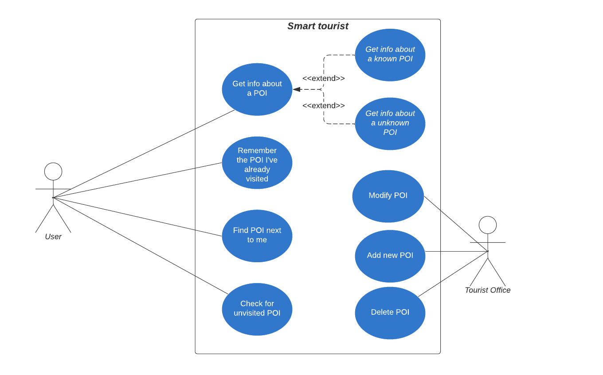
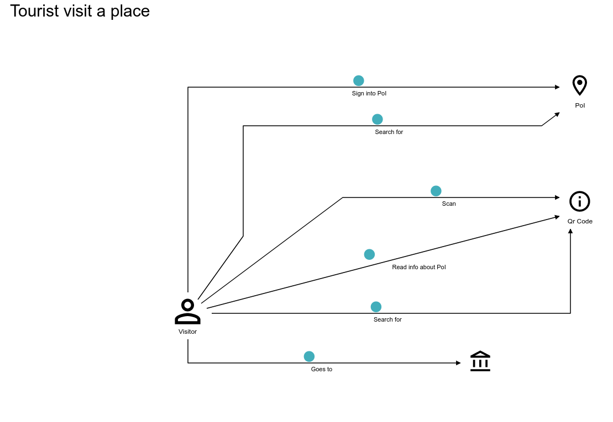
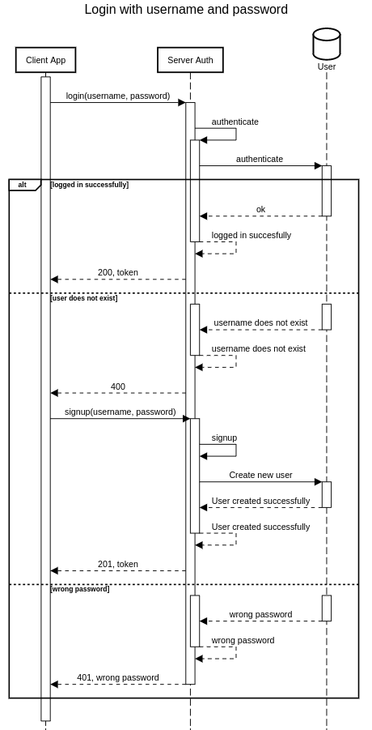
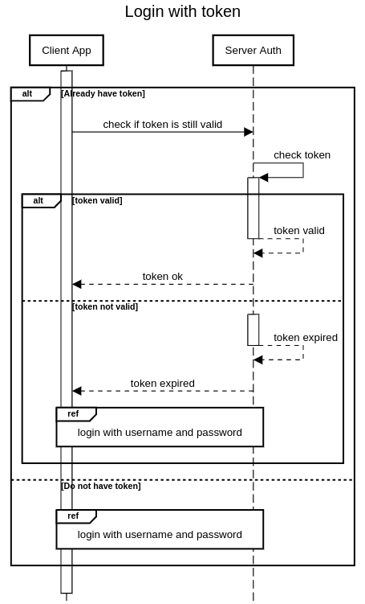
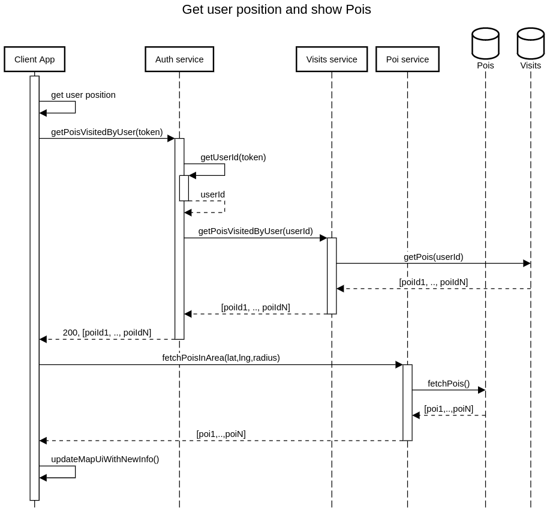
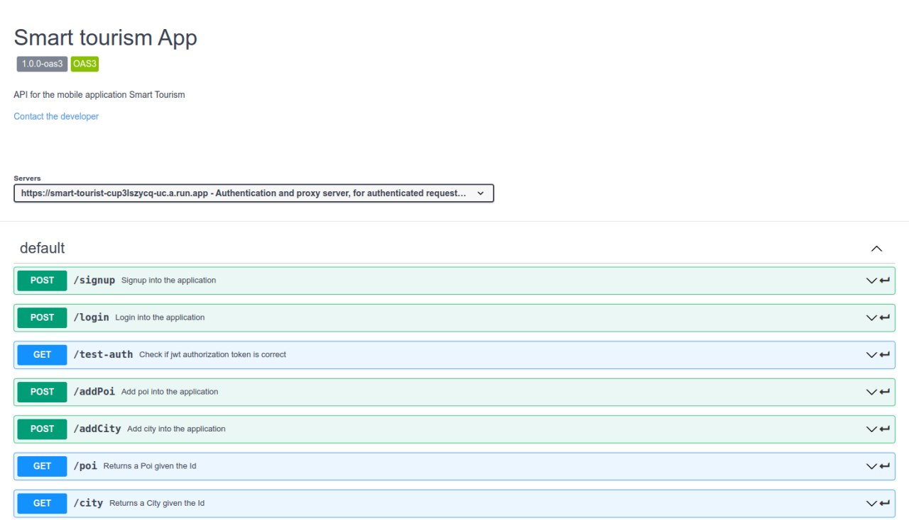
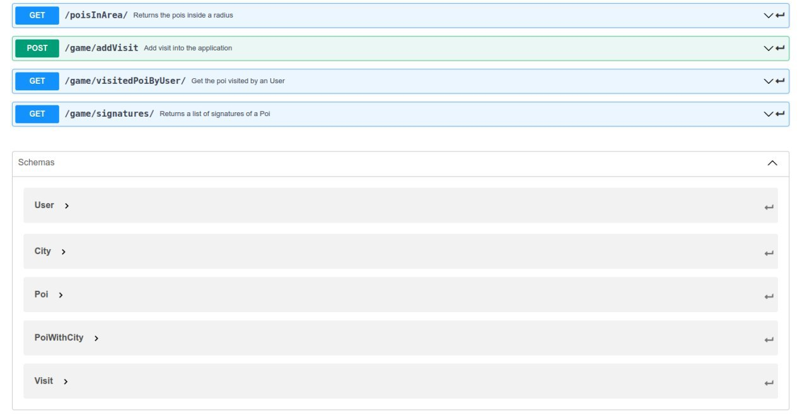
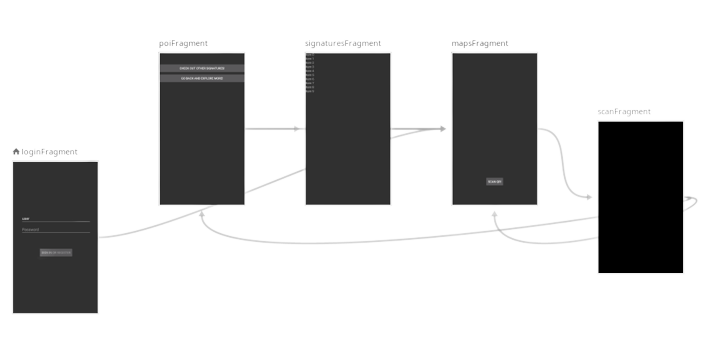

# Smart Tourist

# Table of contents
1. [Introduction](#introduction)
2. [Domain Driver Design](#ddd)
3. [Design](#design)
4. [Development](#development)
6. [Sharing](#sharing)
5. [Continuous integration/delivery/deployment](#cicd)
8. [Conclusion](#conclusion)

# Introduction 
Smart tourist is an application for tourists, it aims to make the experience of visiting a new city more easy and less stressful. This app is meant to give users the possibility to fully and truly understand the history of a city, making the process as fun and interactive as possible.
To do so it relies on an Android application and an online server (composed by different microservices).
The Android app shows to the users a map with different points of interest next to them, the user can then go to every one of this points of interest and read a QR code positioned in that place, after the scannerization of the qr code the app will show info, pictures and a space where the user can sign himself and leave a message for other users and optionally read one other messages.

# Domain Driven Design 

Domain-driven design is a software design and development approach presented by Eric Evans in his book of the same name. DDD is focused on modelling software so as to match a domain according to input created by the domain created by domain experts together with developers.

This is a simple description of what is being thought of when thinking about ddd, but what ddd really is?
Domain-driven design is a metodology, because defines software development support practices, entering the wider field of agile methodologies.
Domain-driven design is a set of pattern, because defines a set of patterns for building domain models.
Domain-driven design is a complexity management technique: it avoids unnecessary complexity and offers tools for scalable management of the complexity of our application.
## Knowledge crunching
The team is composed by two people, Luca Rossi and Davide Schiaroli who are in fact the product owners too.
We talked with each other to design the app, trying to understand what each other wanted to create with this project and even coming up with some terms that ended up being very important and important for the project but for us this process was not enough to be called *knowledge crunching*. 
To mitigate this issue we instructed two colleagues with some informations about our project and we simulated an interview, during which we were supposed to be the team with no knowledge about the project, trying to understand how they envisioned the app, finding key points, differences and so on.
It worked! The idea of the app was practically the same (of course) but they added new concepts and interesting ideas that were coherent with the project and that could have helped it, like badges for the users, zones of interest and other cool ideas that we did not implement because they were too time taking. In a real life project we could have translated this scenario with a demanding client who happened to have low budget. In cases like this the only option is to negotiate and we managed to maintain the same level of quality at the cost of some functionalities.  

##  User stories

User stories are an highly abstract way to rappresent how a team should develop a product.
User stories follow a common pattern:

As [user description], 
i want to [functionality or action] 
so that [goal].

In this way a lot of details can be explained, making programmer's work simple. 
Although it is not a practice based solely on the ddd, user stories are used frequently, because they are extremely simple but effective.

For our purposes, we had to simulate two actors, the tourist and a normal citizen.
### Tourist 
As a tourist, I want to fully experience the new places that I visit.

As a tourist, I want to find places of interest next to me.

As a tourist, I want to know the history of a place.

As a tourist, I want to know the local history of the city I’m visiting.

As a tourist, I want to visit as many places as I can.

As a tourist, I want to remember what I visited.

### Citizen
As a citizen, I want to increase the knowledge of my town.

As a citizen, I want to explore unseen places in my city.

As a citizen, I want to better know the history of known places.

As a citizen, I want to share knowledge about a point of interest.

As a citizen, I want people to fully experience the attractions in the city.

## Use cases
TODO scrivere che fa parte di ddd

## Domain storytelling

Another instrument that we chose to model our domain is *Domain storytelling* and the following is our result.

## Ubiquitous Language

Ubiquitous Language is a term introduced by Eric Evans in his book "Domain Driven Design" that is where DDD is born. 
This language is used when talking to the domain expert and when modelling the domain in order to remove ambiguities. 
The use of a correct language, in an adequate way with respect to the domain models, is very important, from the earliest stages, through to delivery and beyond.
The following are some terms that have been "created" when we discussed with the domain expert.

### Poi - Point of Interest 
Every place reported on the map that has relevance in one of the following areas: CULTURE,  NATURE, FUN. It could be a monument, a square, an historical building, a stadium, a famous street, a park, a fountain and so on. Every poi is characterized by a QR code (placed in the real world), that can be examined to find information about the place, and a marker (in the app) that tells users where it can be found.

### Pois
More then one poi.

### Map
Geographical map that contains our pois and shows them through markers with various colors.

### Markers
A marker represents either a point of interest, a city or the user. Each one of them has a different color to make the app user friendly.

### User 
Anybody who uses the application, currently there are not different roles or privileges between users even though this may change in future.

### Tourist Office 
A special user that can add, modify or delete Pois inside the application.

### Core Domain chart
TODO make a core domain chart.
# Design 

## Sequence diagram

The following diagram will show how the login has been implemented in the current version of the software. It is really likely that the implementation will change in the future, in fact we'll probably add a signup page to make the app more user friendly.

Once the user is logged in a copy of the token used for authentication is saved locally to make the following logins easier and faster.

Surely the main feature of the app is the possibility to show points of interest next to the user and the following diagram shows how we implemented it.

## API 
The api have been written using [Swagger](https://swagger.io) and are  now available [here](openApi.html)

## Android navigation graph

# Development 

## Kotlin
For this project we had to choose a programming language, but we didn't really have to choose only one. Within the Android project, we didn't have much of a choice being java and kotlin the mainstream programming languages and among those two kotlin remains the official language for android development. On top of that Android is widely supported and can benefit from a wide variety of libraries, packages and framework.
For our microservices however we didn't have many constraints, as a matter of fact we could even use a different language for each service. So why did we choose kotlin? The reasons are quite simple, the first and most important one being curiosity. Later in this section we'll discuss more in detail why we've chosen this language and some features that we used. 

## Android 
Currently Android development is [kotlin first](https://developer.android.com/kotlin/first) and developing using kotlin does add some quirks in the Android environment.
In particular these are some of the functionalities in which kotlin prevails over java:
* AndroidX Kotlin-specific APIs (KTX, coroutines, and so on)
* Online training	
* Samples 
* Multi-platform projects
* Jetpack compose
* Compiler plugin support

The most interesting one in our opinion is the presence of Multi-Platforms projects like [Kotlin Multiplatform Mobile](https://kotlinlang.org/lp/mobile/), this project is used to hava a unique codebase that could be shared between different ecosystems (Android and iOS). Unfortunately this project is still in alpha, it needs an Apple system to test the code and the views are not shareable between the different systems, for these reasons we decided not to use it but it's always nice to know that in future we may be able to use part of the code we wrote and use it on another system.

An interesting feature that has been used quite a lot are the coroutines, that enable by default to run asynchronous code in a pretty straightforward way, this feature has been extremely useful with requests to the server.
## Microservices
All the three microservices developed in this project are made using Ktor, a framework useful for creating web application and Http apps in a simple and fast way.

We developed the server using a REST architecture TODO continuare
### Ktor
Ktor has been chosen instead of other similar framework like Quarkus, Spring and Vertx for some of his features like being Kotlin native, support of third party features using plugin (Jwt, Serialization, etc..) and the auto-reload of the server in development mode.

### Auth service
The first and the most important among the microservices is the Authentication one. It is accountable for the authentication and authorization of the user and of proxying the request that has to be authenticated to the other microservice.

The authentication in Ktor is made by the Jwt plugin. It allows the login of users returning a valid Jwt token if the user is already on the user database.
Some paramaters are added to the JWT verifier in order to make the application less prone to security vulnerabilities, like the audience, the issuer, the realm and an expire date. 

For storing only the hashed password we used instead the Bcrpyto library, this makes the app up to date with minimum safety standards in this type of application.
### Poi service
The second microservice is the Poi one. It is used for managing Pois and cities. In addition to the basic functionality for adding cities and pois, it provides some useful functionalities for retrieve the pois given a position (latitude, longitude).
### Visit service
TODO
## Build Automation
For the build automation we used [Gradle](https://gradle.org/) because we studied it during classes and it natively supports Kotlin.

### Android
The Android ecosystem is pretty mature and there is a large variety of plugins and tools that can be used to make the developer life easier.

When a new Android project is created 2 build.gradle are created, a top-level build.gradle and a *module-level build.gradle*.
The first one is located in the root directory and it is used to define the build configurations that will be applied to all modules in the project. This file hasn't been modified too much, in fact only  a couple of plugins have been added.
The module-level build.gradle, located in the project/module directory of the project is where all the dependencies are defined and where the SDK versions are declared. This script has many functions in the project which include additional build types and override settings. 

Speaking of build types, the project is configured to automatically build a release APK. By default it builds a debug APK if every other previous step in the building process is successful, however I wanted to enable this feature too. 
A release APK is different from a debug APK, mainly for one reason, it is signed, and to do so a **KeyStore** needs to be created for example by using [keytool](https://docs.oracle.com/cd/E19509-01/820-3503/ggfen/index.html). As the documentation says **keytool** uses JKS as the format of the key and certificate databases (KeyStore and TrustStores). A CA must sign the certificate signing request (CSR). The CA is therefore trusted by the server-side application to which the Adapter is connected.
Once the JKS file has been created it has to be placed in the same directory as the module-level build.gradle.
Inside the build.gradle there should be a signingConfigs block with all the information needed to sign the app.
In the buildTypes block we specify to sign the release APK and we enable code shrinking, optimization and obfuscation.
The shrinking and obfuscation process however created some problems making the app unusable, for this reason we disabled it, but in future we could learn more about the **ProGuard rules** to re-enble it.

This app also relies on the Google Maps API, so we had to get an API key through the Google Cloud Console and place it in a separate local file, called local.properties.
The local.properties file is not supposed to be versioned for security reasons and the contents inside it are accessed through the *mapsplatform.secrets-gradle-plugin* as the documentation suggests.
TODO I don't remember what i wanted to say..... Another cool feature that has been used in this project is the Android [Navigation Component](https://developer.android.com/guide/navigation/navigation-getting-started). It allowed us to define a graph inside an XML file where we specified all the [Fragments](https://developer.android.com/guide/fragments) in the app and the possible paths between them. The usage of this component greatly simplified the writing process and allowed us to abstract a little bit from the implementation of the underlying structure of the project.

The build process of course also runs tests and only ends successfully if every test passes, however the Android test suite is quite large and the ecosystem is pretty complex and unfortunately we didn’t manage to find enough time to experiment with new types of tests, in fact only a bunch of unit tests have been made. 
A copy of the working APK can be found online and can be used to test if everything works as expected on different smartphones.

### Microservices

# Sharing 
## Software versioning
Software versioning has been used within the android app to identify different versions of the application package. Semantic versioning has been used to serve this purpose, however the first tag created was named v0.0.1 and even though the syntax is not the most correct we decided not to delete it because it was even released inside github. For this reason every subsequent release and tag is in the form vX.Y.Z-alpha, where X, Y and Z are numbers and -alpha is an annotation for an early release.
The -alpha suffix has been dropped almost instantly because the app wasn't, and still isn't, in its final form.
Version scopes currently coincide in our project.
## Software licensing

# Continuous integration/delivery/deployment 
TODO parlare delle github pages
dependabot(?), all stuff inside local.properties even though there should be a separate file. keystore.properties
### Version control
Git was chosen as the version control tool and GitHub as the online platform to make the code distributed.

In this project, all the commits made by the developers are signed, because it can show the real owner of a commit. While not vital in this project, it can be very useful in large projects with many developers

We have often used the "squash" functionality, in order to remove lot of useless commit that unnecessarily filled the git log of commit.

TODO Riguardare questa parte, abbiamo piu' di tre branch
We have organized our repository in three branch, the default branch main, a branch for the development of the android app, one for the server, and other branch for other less important purposes like the report, the branch created automatically by dependabot and one for the github page.
 
 TODO possible use of rebase to implement features in one of the branch dependabot(?) organization is not example, where do we put it?
 
### Containerization
In order to make the easier the process of distribution and deployment of the microservices, we encapsulated those services into separate Docker containers. 
This was of crucial importance as it made the development process lighter, faster and easier to debug.
Having different containers could have made the development even faster with an higher number of human resources, in fact being the microservices almost independent from each other the writing process could have scaled really well. 

In order to create those containers, three different Dockerfile have been created, those Dockerfile are used by Google Cloud Run when a commit is pushed to create a running container in the cloud. Every different update of the container is called "Revision".

### Google Cloud Run
We created also an action for every microservice, so a new istance of the container is deployed at every push in the server branch, or when a pull request is made.
This has been possible using the google cloud run api, that can be used for this purpose. 

# Conclusion 
## Team components and workload

The team is composed by two people, Luca Rossi and Davide Schiaroli. In the firsts phases of the team worked together to build an accurate model and define the Domain. After this process a server (composed by three microservices) and an Android app were identified. The team agreed to divide the workload into two main parts, the server and the android App. The android app has been developed by Luca Rossi and the server by Davide Schiaroli.
The parts regarding integration and deployment has been studied together, in order to choose the best strategy for distributing the app or the best way to make available the app online, but has been developed individually.

## How does it work?
spiegazione del funzionamento dell’app, se lo si scrive bene si puo’ mettere anche nel readme.

## Future Works

Scrivere da qualche parte la divisione dei lavori
